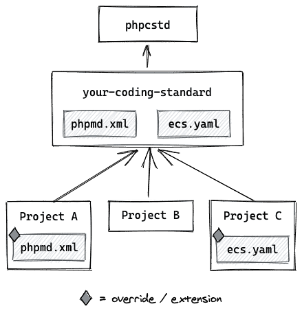

# php-coding-standard (phpcstd)
`phpcstd` combines various code quality tools (e.g. linting and static analysis)
into one, easy to use package which can be shared across teams and code bases.

There are two parts to this:
1. `phpcstd` executes all the enabled tools and returns a single per-file error output
2. In your projects, you depend on a single repository (like `your-company/code-quality-configs`) which depends on `phpcstd` and includes the various base configurations (e.g. phpmd.xml, ecs.yaml, ...)

`phpcstd` itself does not come with any tools preinstalled. 
You can take a look at [my own coding standards](https://github.com/spaceemotion/my-php-coding-standard) as an example.



#### Tools supported
Tool | Description
-----|------------
[EasyCodingStandard](https://github.com/symplify/easy-coding-standard) | Detects styling issues using a variety of linting tools
[phpstan](https://github.com/phpstan/phpstan) | Runs logical checks
[PHP Mess Detector](https://github.com/phpmd/phpmd) | Tries to keep code complexity to a minimum
[php-parallel-lint](https://github.com/php-parallel-lint/php-parallel-lint) | Quickly lints the whole project against PHP (syntax) errors
[composer-normalize](https://github.com/ergebnis/composer-normalize) | Normalizes composer.json files

## Getting started
```
composer require-dev spaceemotion/php-coding-standard
```

This will install the `phpcstd` binary to your vendor folder.

### Configuration via .phpcstd(.dist).ini
To minimize dependencies, `phpcstd` used ini-files for its configuration. If no `.phpcstd.ini` file can be found in your project folder, a `.phpcstd.dist.ini` file will be used as fallback (if possible).

### Command options
```
$ phpcstd [options] <files or folders>

--ci
  Changes the output format to checkstyle.xml for better CI integration

--fix
  Try to fix any linting errors (disables other tools)

--continue
  Just run the next check if the previous one failed

--help
  Displays this help message
```

## Development
### Using XDebug
This project uses [composer/xdebug-handler](https://github.com/composer/xdebug-handler) to improve performance
by disabling xdebug upon startup. To enable XDebug during development you need to set the following env variable:
`MYAPP_ALLOW_XDEBUG=1` (as written in their README).
