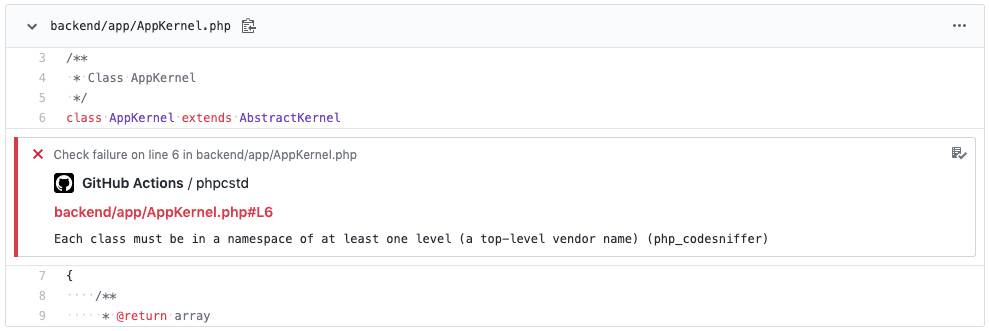

[](https://packagist.org/packages/spaceemotion/php-coding-standard) 
[](https://packagist.org/packages/spaceemotion/php-coding-standard)

# php-coding-standard (phpcstd)


`phpcstd` combines various code quality tools (e.g. linting and static analysis)
into one, easy to use package which can be shared across teams and code bases.

There are two parts to this:
1. `phpcstd` executes all the enabled tools and returns a single per-file error output
2. In your projects, you depend on a single repository (e.g. `acme/coding-standard`) 
   which depends on `phpcstd` and includes the various base configurations 
   (e.g. phpmd.xml, ecs.yaml, ...). Your own projects then depend on your own coding standard.

`phpcstd` itself does not come with any tools preinstalled. 
You can take a look at [my own coding standards](https://github.com/spaceemotion/my-php-coding-standard) as an example.

#### Tools supported
Tool | Lint | Fix | Source list | Description
-----|------|-----|-------------|-----------
[composer-normalize](https://github.com/ergebnis/composer-normalize) | ✅ | ✅ | ✅ | Validates and rearranges composer.json files
[EasyCodingStandard](https://github.com/symplify/easy-coding-standard) | ✅ | ✅ | ✅ | Combination of PHP_CodeSniffer and PHP-CS-Fixer
[PHP Mess Detector](https://github.com/phpmd/phpmd) | ✅ | ❌ | ✅ | Code complexity checker
[php-parallel-lint](https://github.com/php-parallel-lint/php-parallel-lint) | ✅ | ❌ | ✅ | Checks for PHP (syntax) errors (using `php -l`)
[PHP_CodeSniffer](https://github.com/squizlabs/PHP_CodeSniffer) | ✅ | ✅ | ✅ | Style linter + fixer
[phpstan](https://github.com/phpstan/phpstan) | ✅ | ✅ | ✅ | Static analyzer
[psalm](https://github.com/vimeo/psalm) | ✅ | ✅ | ✅ | Static analyzer
[phan](https://github.com/phan/phan) | ✅ | ✅ | ❌ | Static analyzer

## Getting started
```
composer require-dev spaceemotion/php-coding-standard
```

This will install the `phpcstd` binary to your vendor folder.

### Configuration via .phpcstd(.dist).ini
To minimize dependencies, `phpcstd` used ini-files for its configuration. If no `.phpcstd.ini` file can be found in your project folder, a `.phpcstd.dist.ini` file will be used as fallback (if possible).

### Command options
```
$ phpcstd [options] <files or folders>

--ci
  Changes the output for github actions to automatically add PR annotations

--fix
  Try to fix any linting errors (disables other tools)

--continue
  Just run the next check if the previous one failed

--hide-source
  Hides the "source" lines from console output

--help
  Displays this help message
```

Instead of defining the files/folders directly (in either the config or as arguments), you can also pipe a list into it:
```
$ ls -A1 | vendor/bin/phpcstd
```

## Git Hooks
To not have to wait for CI pipelines to finish, you can use git hooks to run over the changed files before committing.

```sh
git diff --name-only --cached | vendor/bin/phpcstd
```

## CI-Support
### Github Actions
The `--ci` flag returns a format that can be used by GithubActions to annotate commits and PRs
(see [their documentation on how this works](https://github.com/actions/toolkit/blob/master/docs/commands.md#problem-matchers)).



## Development
### Using XDebug
This project uses [composer/xdebug-handler](https://github.com/composer/xdebug-handler) to improve performance
by disabling xdebug upon startup. To enable XDebug during development you need to set the following env variable:
`MYAPP_ALLOW_XDEBUG=1` (as written in their README).
